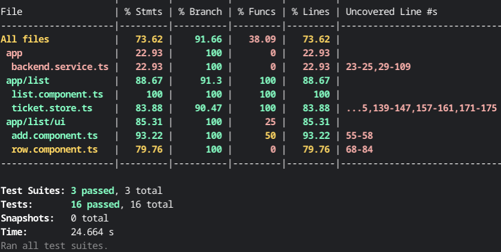
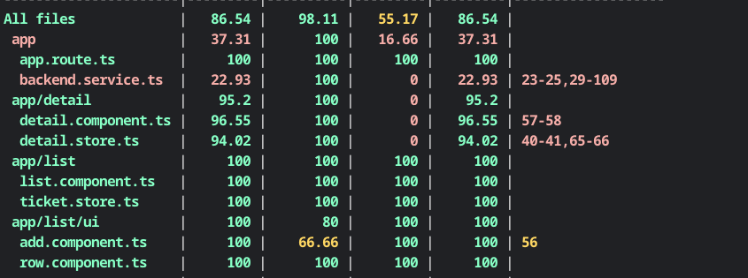
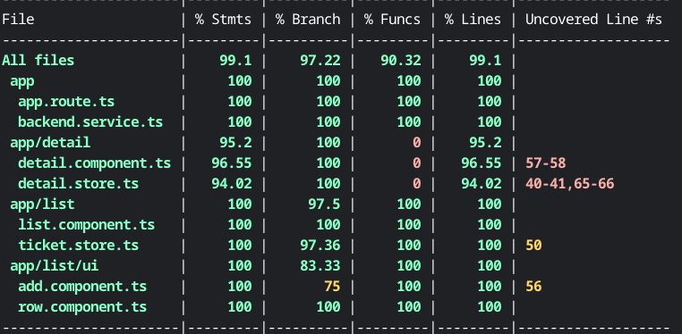

# Testing Todos List

[Angular Challenges](https://github.com/tomalaforge/angular-challenges) #28 Todo list app testing

## Built With

- [Angular](https://angular.io)
- [Angular CLI](https://github.com/angular/angular-cli) version 16.2.2.
- [Angular Testing Library](https://testing-library.com/docs/angular-testing-library/intro)

## Directions

In this application, you can search for tickets, you can assign or finish them. You can also create new tickets.

This is a very simple application, but it will let you deal with asynchronous task and mocks.

The goal of this challenge is to write all test cases of `ticket.store` , `list.component` and `row.component` with Testing Library.

You can also do it with cypress.

## Screenshots

### Initial Code Coverage


***

### Thomas Laforge Solution's Code Coverage



***

### This Repo's Code Coverage



***

## Thoughts

- I actually think testing this application would be easier with karma and jasmine.  There are more code examples to compare and contrast.  
- There is a distinct lack of documentation of testing NgRx component stores.  With Jest and Testing Library added, the odds of finding anything great to follow is slim to none.  
- The examples I did find are not current with the lastest practices.   
- I referenced Tim Deschryver's blog often to test this app.  This [article](https://timdeschryver.dev/blog/testing-an-ngrx-project#unit-tests) is a *must* read for testing NgRx.  It is pretty much the only great resource out there that will help someone complete this challenge.  
- I ran test coverage first and then ran the app.  I stopped the app but left it in the browser and then started to work on writing tests.  I referred back to the app often.  
- `Done` can only be updated once. However, you can change the assignee after the todo is already done.  Unintended bug?
- To test the row component, you need to look up Input/Output testing.  Check out the Input / Output Angular challenge. 
- I replicated Input / Output testing for the add component as well.   
- "Incorrect use of <label for=FORM_ELEMENT>" error with the assign select input.  This seems to be a recurring problem with Angular Material. I have to investigate further to see what the issue is.  The error doesn't seem to really affect the performance of the app. I ignored it.
- I need to look into the differences between using router and location in testing.  Mocking Router seems to be a slower solution that just using location and location.path().
- Once you start adding testids, it is tempting to keep adding more.  Testids really do speed up the testing process. 

## Continued Development

- ticket store tests
- change tests that depend on using testid
- Angular Material error

## How to Use

```bash 

git clone https://github.com/jdegand/testing-todos-list.git

# cd into the directory
npm install

# Jest 

npm test

# Jest with Coverage

npm run test:coverage

```

## Useful Resources

- [Tailwind](https://tailwindcss.com/docs/guides/angular) - angular
- [Medium](https://medium.com/@megha.d.parmar2018/angular-unit-testing-with-jest-2023-2676faa2e564) - angular unit testing with jest 2023
- [Stack Overflow](https://stackoverflow.com/questions/41697513/can-i-mock-functions-with-specific-arguments-using-jest) - can i mock functions with specific arguments using jest
- [Stack Overflow](https://stackoverflow.com/questions/57946870/how-to-select-an-option-from-a-select-list-with-react-testing-library) - how to select an option from a select list with react testing library
- [Stack Overflow](https://stackoverflow.com/questions/52052895/angular-material-component-not-working-mat-option-is-not-a-known-element) - angular material component not working mat option is not a known element
- [Github](https://github.com/testing-library/angular-testing-library/blob/main/apps/example-app/src/app/examples/02-input-output.spec.ts) - input output spec
- [Testing Library](https://testing-library.com/docs/angular-testing-library/api) - angular testing library api
- [Stack Overflow](https://stackoverflow.com/questions/70096180/how-to-associate-mat-label-and-mat-select-when-mat-label-is-outside-of-mat-form) - mat label and mat select
- [Stack Overflow](https://stackoverflow.com/questions/60573172/angular-material-mat-option-not-visible-in-tests) - angular material mat option not visible in tests
- [Clarity Dev](https://claritydev.net/blog/testing-select-components-react-testing-library) - testing select components react testing library
- [Stack Overflow](https://stackoverflow.com/questions/56450141/creating-mat-option-elements-with-ngfor-when-list-initialized-empty) - creating mat option elements with ngFor when list initialized as empty
- [Github](https://github.com/angular/components/issues/27241) - feat(material/form-field): add MatLabel input property to change use of html label
- [Stack Overflow](https://stackoverflow.com/questions/76377013/react-testing-library-select-dropdown-option-isnt-selecting-anything) - react testing library select dropdown option isnt selecting anything
- [Stack Overflow](https://stackoverflow.com/questions/41939511/how-can-i-get-the-arguments-called-in-jest-mock-function) - how can i get the arguments call in jest mock function
- [Stack Overflow](https://stackoverflow.com/questions/66872744/how-to-mock-the-router-navigate-method-in-jest) - how to mock the router navigate method in jest
- [Blog](https://balavishnuvj.com/blog/testing-lists-items-with-react-testing-library/) - testing lists items with react testing library
- [Github](https://github.com/testing-library/angular-testing-library/blob/main/apps/example-app/src/app/examples/09-router.spec.ts) - angular testing library router spec
- [in depth dev](https://indepth.dev/posts/1519/router-data-as-components-inputs-in-angular-v16) - router data as components input in angular v16
- [Blog](https://blog.angular.io/write-better-tests-without-router-mocks-stubs-bf5fc95c1c57) - write better tests without router mocks stubs
- [Stack Overflow](https://stackoverflow.com/questions/41632996/testing-if-proper-route-is-called-after-clicking-on-a-button) - testing if proper route is called after clicking a button
- [Dev.to](https://dev.to/this-is-angular/testing-angular-routing-components-with-the-routertestingmodule-4cj0) - testing angular routing components with routerTestingModule
- [Github](https://github.com/ngfelixl/ngrx-component-store-testing) - ngrx component store testing
- [Stack Overflow](https://stackoverflow.com/questions/67327752/what-is-the-equivalent-of-jasmine-createspyobj-for-jest) - what is the equivalent of jasmine createSpyObject for test
- [Github](https://github.com/ngrx/platform/issues/2767) - ngrx component store testing
- [YouTube](https://www.youtube.com/watch?v=mxokTCBwg2E) - Testing NgRx Component Store - BLS020 SHOW & TELL WITH CHAU TRAN
- [Github](https://github.com/trungk18/angular-spotify/compare/main...feat/playlist-store-test#diff-08fb231d17aa052fbea5467a02a3283ff2ae0e5ef9ca4ed319040b5ce5509f42) - code from Texting NgRx Component Store video
- [Blog](https://timdeschryver.dev/blog/testing-an-ngrx-project#unit-tests) - testing an ngrx project unit tests
- [Medium](https://medium.com/@kolodny/testing-with-sifers-c9d6bb5b362) - SIFERS
- [Beyond Java](https://www.beyondjava.net/jest-testing-an-angular-service) - jest testing an angular service
- [Stack Overflow](https://stackoverflow.com/questions/72566904/test-angular-http-service-with-jest) - test angular http service with jest
- [Stack Overflow](https://stackoverflow.com/questions/68209510/how-to-access-text-broken-by-multiple-elements-in-testing-library) - how to access text broken by multiple elements in testing library
- [Stack Overflow](https://stackoverflow.com/questions/70700684/best-way-to-test-a-text-in-a-div-or-p-tag-in-react-testing-library) - best way to test a text in a div or p tag in react testing library
- [Blog](https://polvara.me/posts/five-things-you-didnt-know-about-testing-library) - 5 things you didn't know about testing library
- [Blog](https://timdeschryver.dev/blog/making-sure-youre-using-the-correct-query#byrole-provides-a-solution-to) - byRole can help eliminate the multiple element querying problems
- [Stack Overflow](https://stackoverflow.com/questions/45304270/jest-createspyobj) - jest createSpyObj
- [Medium](https://itnext.io/complete-testing-of-angular-ngrx-store-with-jest-a4ac5fb55e23) - complete testing of angular ngrx store with jest
- [Medium](https://vugar-005.medium.com/angular-unit-testing-without-testbed-ed7832df8ad9) - angular unit testing without testbed
- [Dev.to](https://dev.to/this-is-angular/testing-angular-routing-components-with-the-routertestingmodule-4cj0) - testing angular routing components with the router testing module
- [Stack Overflow](https://stackoverflow.com/questions/39791773/how-can-i-unit-test-a-component-that-uses-the-router-in-angular) - how can I unit test a component that uses the router in angular
- [Stack Overflow](https://stackoverflow.com/questions/67718077/difference-between-testbed-injectservicename-and-fixture-debugelement-injector) - difference between testbed inject and fixtue debug element injector
- [Stack Overflow](https://stackoverflow.com/questions/58081360/anchor-href-vs-angular-routerlink) - href vs routerLink
- [YouTube](https://www.youtube.com/watch?v=FJvk9YyXTLo) - Services | HttpClient | Observables | JEST Unit Testing tutorial for Angular part 4 | Techopsworld
- [Stack Overflow](https://stackoverflow.com/questions/39577920/angular-2-unit-testing-components-with-routerlink) - angular 2 unit testing components with routerlink
- [Blog](https://blog.angular.io/write-better-tests-without-router-mocks-stubs-bf5fc95c1c57) - write better tests without router mocks stubs
- [Dev.to](https://dev.to/this-is-angular/testing-angular-routing-components-with-the-routertestingmodule-4cj0) - testing angular components with the routerTestingModule
- [Dev.to](https://dev.to/tipsy_dev/testing-library-writing-better-async-tests-c67) - testing library writing better async tests